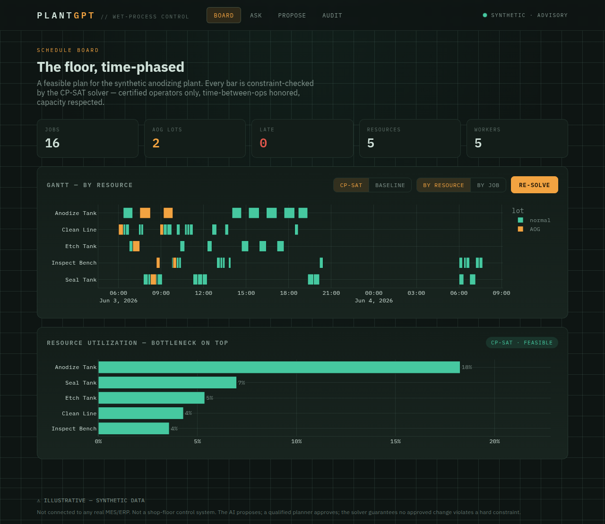

# PlantGPT

A conversational plant-operations brain with a real **production scheduler** underneath — ask anything about the floor in plain English, and have it *propose* (never silently commit) a re-sequence that **can't violate a hard constraint**.

> **⚠ Illustrative tool on synthetic data — not connected to any real MES/ERP, not a shop-floor control system.** No employer data, ever.



Part of [hector-garza.com](https://hector-garza.com)'s portfolio. One of **three equal deliverables**: the app, a **Decision Record** ([`DECISIONS.md`](./DECISIONS.md)), and a recorded whiteboard session. A working demo no longer proves competence — the judgment behind it does. The hireable signal here is **how you put AI on top of a constrained operational system safely**: what the agent may answer, what it may *propose*, what it can never do, and the plant constraints encoded that an AI-only engineer doesn't know exist.

---

## What it does

**Pillar A — Production scheduler.** Sequences parts through their routings (clean → etch → anodize → seal → inspect) across shared lines/tanks and **qualified** workers, producing a feasible, time-phased plan. Two solvers run side by side: an explainable **dispatching baseline** (EDD / critical-ratio / SPT) and a **Google OR-Tools CP-SAT** solver. The solver enforces every hard constraint — routing precedence, resource capacity, **operator certification**, **time-between-operations** limits, worker shifts, and maintenance windows — and returns either a feasible schedule *or* an explicit "infeasible". It never presents a hand-built or LLM-built plan as feasible.

**Pillar B — Conversational layer (PlantGPT).**
- **Ask** (read-only, auditable) — plain-English questions answered from *typed read-only tools*. The agent **shows the query it ran** and flags a confidence level. It can read the schedule; it cannot change it.
- **Propose** (write, but gated) — an intent ("expedite lot 14 for AOG") becomes one **scheduler request** — the only write path. The system re-solves through CP-SAT, shows an **impact preview** (what slips, the tardiness delta, feasibility), and the agent recommends. **Nothing is applied until a human approves**, and an infeasible change can never be committed.

Every query and every decision is written to an **audit trail**.

> **The safety thesis, in one line:** the AI proposes, the constraint solver enforces, a human disposes. The AI can never commit a change, and can never produce an infeasible schedule.

---

## Run it locally (one command)

Requires Docker.

```bash
docker compose up --build
```

Then open **http://localhost:8000**. On first load, click **Seed plant** (loads the synthetic corpus — 16 jobs across 4 routings) and **Re-solve**. The schedule board, baseline-vs-CP-SAT toggle, utilization view, and audit trail all work with no API key.

To enable the **Ask** and **Propose** AI layer, export an Anthropic key in the same shell before starting (it is passed through to the container and **never written to a file or committed**):

```bash
export ANTHROPIC_API_KEY=sk-ant-...   # your key; stays in your shell
docker compose up --build
```

Without a key, Ask/Propose show a "set the key" notice; everything else is fully usable.

### Tests

```bash
pip install -e ".[dev]"
DATABASE_URL=sqlite:// pytest -q          # fast loop
ruff check .
```

The suite covers the crown jewels: the solver's hard-constraint enforcement (no uncertified/off-shift assignment, no time-between-ops violation, capacity, over-constrained → infeasible, AOG weighting, beats-baseline), the read-only query safety, and the propose→approve gate. The conversational layer is unit-tested against a mocked Anthropic client (no key needed in CI).

---

## Architecture

```
┌───────────────────────────────────────────────────────────────────┐
│  Browser — Board / Ask / Propose / Audit  (Django templates · HTMX) │
│   • Plotly Gantt (by resource / by job) · utilization · baseline⇄CP-SAT
│   • Ask: query box → shown query + answer + confidence              │
│   • Propose: intent → impact diff → Approve / Reject                 │
└───────────────▲───────────────────────────────┬───────────────────┘
                │                                 │
┌───────────────┴─────────────────────────────────▼───────────────────┐
│  Backend — Django + Postgres                                          │
│   plant/model/      Job · Operation · Routing · Resource · Worker ·   │
│                     Certification · Shift · Schedule · AuditEvent     │
│   plant/scheduler/  dispatch.py (baseline) · cpsat.py (SAFETY CORE) · │
│                     resolve.py (disruption re-solve + diff)           │
│   plant/query/      typed read-only tools (no SQL, no mutation)       │
│   plant/propose/    SchedulerRequest (only write path) · preview/     │
│                     approve gate                                       │
│   plant/agent/      Claude tool-use: ask (read tools) + propose       │
│                     (one gated tool) — no direct-mutation tool exists  │
│   plant/data/       synthetic plant corpus (seeded, fixed)            │
└──────────────────────────────────────────────────────────────────────┘
```

**Hard-constraint enforcement lives in exactly one place** — `plant/scheduler/cpsat.py`. No other path (UI, agent, LLM) ever produces or commits a schedule.

---

## Tech stack

- **Backend:** Django 5 + Postgres 16
- **Scheduler:** Google OR-Tools (CP-SAT) + an EDD/critical-ratio/SPT dispatching baseline
- **AI:** Anthropic SDK (Claude `claude-opus-4-8`) — tool use split into **read tools** vs. **one gated propose tool**, structured-ish typed outputs, prompt caching, token-capped
- **Frontend:** Django templates + HTMX + Plotly (server-rendered Gantt)
- **Packaging:** Docker / docker-compose · **Quality:** pytest + ruff + GitHub Actions CI

---

## Security & data

- **No secret is ever committed.** `ANTHROPIC_API_KEY` is read from the environment only — a host secret on Render (`sync: false` in `render.yaml`), or your shell locally. `.env` is gitignored; the repo and its full history contain no key.
- **Synthetic data only.** A small, obviously-fictional plant with a fixed seed. No real routings, parts, capacities, names, or employer IP — ever.
- **Advisory, not autonomous.** The AI never auto-commits; a qualified planner approves; the solver guarantees no approved change violates a hard constraint.

---

## Links

- 🔗 **Live demo:** _TBD (Render — `plant.hector-garza.com` planned)_
- 🧠 **Decision record:** [`DECISIONS.md`](./DECISIONS.md) — Situation · Decision · Risk · Change
- 🎥 **Whiteboard walkthrough:** _TBD_
- 📐 **Spec & plan:** [`SPEC.md`](./SPEC.md) · [`PLAN.md`](./PLAN.md)

## Deployment

Dockerized Django + managed Postgres on **Render** via [`render.yaml`](./render.yaml) (Blueprint), fronted by Cloudflare. The image runs `collectstatic` at build, migrates on start, and serves via gunicorn with a `/healthz` health check. `ANTHROPIC_API_KEY` is entered once in the Render dashboard — never in the repo. See [`DEPLOY.md`](./DEPLOY.md) for the step-by-step.
